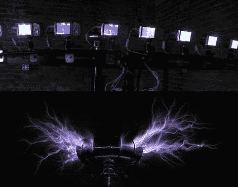

# 特斯拉线圈子弹时间摄影

> 原文：<https://hackaday.com/2011/06/29/tesla-coil-bullet-time-photography/>

我们可能都同意的一件事是，特斯拉线圈一部分是高压电，另一部分是纯粹的可怕。[【Rob Flickenger】也这么认为](http://hackerfriendly.com/2011/06/bullet-time-lightning/)，不久前他在自己的工作室里造了一个相当不错的。他拍了一堆照片展示线圈的能力，但他认为从单一角度拍摄的一张照片并不能传达观看特斯拉线圈运行是多么美妙。

受《黑客帝国》电影的启发，他买了一堆佳能傻瓜相机，并在自己的工作室里建造了一个子弹计时装置。为了拍出恰到好处的照片，他给每台相机安装了定制版的 CHDK 固件，只需按一下按钮，就能启动所有十个快门。一些脚本有助于收集所有的图像进行处理，之后他识别出好的镜头并将它们缝合在一起。你可以在下面的视频中看到令人惊叹的结果。

[via [LaughingSquid](http://laughingsquid.com/tesla-coil-lightning-viewed-in-matrix-style-bullet-time/)

【维梅奥 http://vimeo.com/24977187 w = 470】