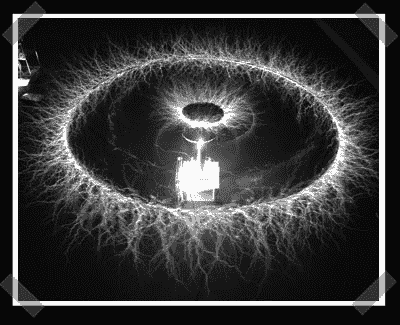

# 泰斯拉为索隆之眼提供能量

> 原文：<https://hackaday.com/2007/02/03/tesla-powered-saurons-eye/>

【彼得】送来了他的[最新](http://tesladownunder.com/TeslaRotBreakoutTopView1000.jpg)特斯拉线圈实验。他称之为“索伦之眼”效应。它是通过在已经很强大的特斯拉线圈上增加一个[旋转突破](http://tesladownunder.com/tesla_coil_sparks.htm#Rotating%20long%20breakout%20point)创造出来的。它与托尔金梦中的邪恶之眼不太一样，这张照片是 7 英尺铝管旋转两圈的 22 秒曝光。

*   [永久链接](http://tesladownunder.com/TeslaRotBreakoutTopView1000.jpg)