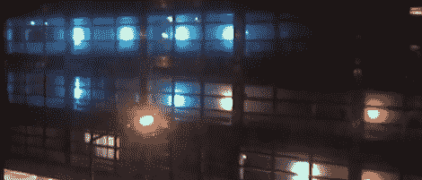

# 建筑物上的俄罗斯方块

> 原文：<https://hackaday.com/2011/10/05/tetris-on-a-building/>

大约一年前，苏黎世联邦理工学院的人机界面大楼安装了一束闪光灯。这些 LED 点不是交互式的，只显示硬编码图案。当然，一堆发光二极管需要交互性，所以在今年第一学期的聚会上，一个巨大的俄罗斯方块游戏被建在了一栋建筑的侧面。

没有官方的构建日志，但据我们所知，这些 led 连接到一个 [DMX 控制器](http://www.digital-enlightenment.de/usbdmx.htm)上，后者依次插入一台计算机和大学的以太网。对于俄罗斯方块游戏的[命令和控制](http://hackaday.com/wp-content/uploads/2011/10/base.jpg)，一个 USB 操纵杆被连接到一个从垃圾堆中拖出的[旧戴尔](http://hackaday.com/wp-content/uploads/2011/10/dell.jpg)。

该项目的软件，该项目的 LED 端是用 Visual C++编写的，重用了旧的俄罗斯方块例程和来自 DMX 控制器的示例代码。对于控制器部分，所有东西都是用 c 编写的。控制器只是将字符转储到第二台计算机上的 TCP 端口。虽然俄罗斯方块棋盘只有 3 像素宽，但有相当多的人排队想玩。