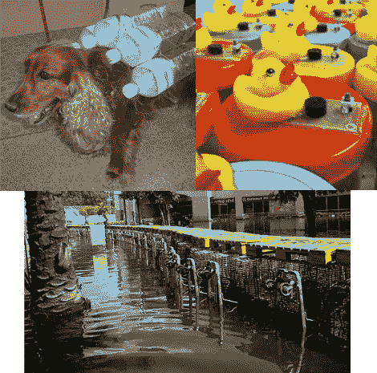

# 泰国居民利用黑客来充分利用这种糟糕的情况

> 原文：<https://hackaday.com/2011/11/11/thailand-residents-use-hacks-to-make-the-best-of-a-horrible-situation/>

泰国正在应对可怕的洪水。尽管困难重重，人们仍然需要四处走动，继续生活，因此许多人想出了巧妙的方法来使这场灾难更易于管理。[Jan]来信让我们了解他收集的这些与洪水相关的信息。它们种类繁多，许多给我们带来了笑容，从这种塑料袋密封的汽车开始(没有照片)。

我们抽出其中的三个来突出上面。左上角是一件用空饮料瓶做成的狗救生衣，装在某种背带上。我们希望宠物能远离洪水，但这是一个很好的预防措施。说到预防措施，图片右边的橡皮鸭是一个电子危险探测器。将它漂浮在水中，如果检测到交流电流，警报和 LED 就会熄灭。最后，底部的图像显示了一座在购物中心前建造的桥，它是通过将手推车倒置并在通道上铺设木托盘来实现的。

有几个浮动和两栖车辆黑客在收集。不过，到目前为止，我们还没有看到任何由钻机驱动的拖曳马达。