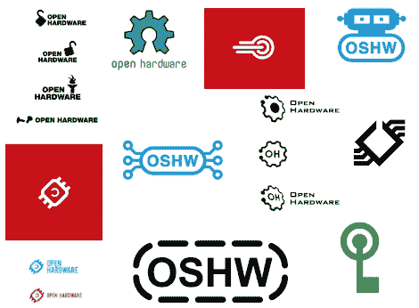

# 谢谢你毁了一件好事，或者试图毁了一件好事！

> 原文：<https://hackaday.com/2011/03/31/thanks-for-ruining-a-good-thing-or-trying-to/>

OSHW 标志投票页面[似乎发生了一些恶作剧，因为一些人使用脚本为他们最喜欢的设计](http://www.openhardwaresummit.org/2011/03/31/thanks-for-ruining-a-good-thing-or-trying-to/)游戏系统。为什么？谁知道…怎么会？OSHW[比尔·波特]的一位支持者着手解决这个问题，现在事情应该得到解决，尽管在最后一天(4 月 5 日^(3 日)仍有 3122 张错误的选票需要剔除。)

虽然很难想象有人会如此执着于一个标志，仅仅为了游戏投票而写一个脚本，但考虑到我们在某些话题上可能是一个非常外向的群体，这并不奇怪。组织者问你是否是列出的 IP 地址之一，并有良好的意愿坦白，并告诉你投票支持哪个(些)标志，以使这一过程更容易。如果没有，那么，“这不会阻止每个人的良好努力。”

如果你刚刚得到 OSHW 标志投票的消息，请查看我们之前的文章以了解更多细节。