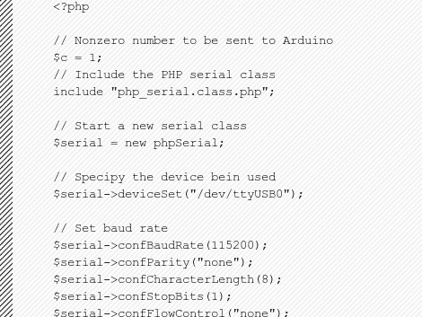

# 用 PHP 控制 Arduino 的基础

> 原文：<https://hackaday.com/2011/03/17/the-basics-of-controlling-an-arduino-with-php/>

如果 Arduino 离服务器足够近，可以通过 USB 连接，您可以轻松地为其添加基于互联网的控制。本教程将为你提供使用它所需的基础知识。

这种方法的要点包括一个包含 PHP 元素的网页。当这些元件中的一个被操作时，一个命令通过串行连接被发送到 Arduino，Arduino 然后根据它接收到的信息做出反应。这个例子使用了一个运行 Apache 服务器的 Ubuntu box。Arduino 草图设置串行连接，然后监听传入的流量。每当它收到一个非零字符，一个 LED 将闪烁。在服务器端，您需要确保运行 Apache (www-data)的系统用户有权限写入串行端口。

这个基本的例子看起来非常简单，但是您可以在它的基础上构建无限的东西。可以添加不同的 PHP 事件来通过串行连接推送新的命令，并将匹配的测试条件添加到草图中。

[谢谢贾里德]