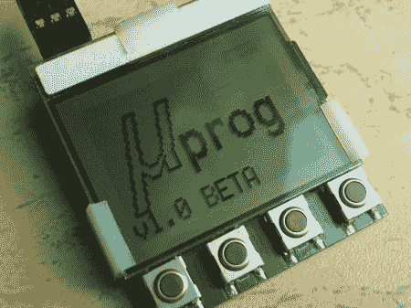

# 适合您口袋的完整 AVR 编程器

> 原文：<https://hackaday.com/2011/06/06/the-complete-avr-programmer-that-fits-in-your-pocket/>

在过去的几年里，我们已经看到了一些非常好的基于 AVR 的项目。现在他刚刚完成了他的最新项目，即 [Prog](http://diy.elektroda.eu/uprog-maly-szybki-przenosny-programator-avr-z-sd/?lang=en "uProg") ，这是一个拥有一系列功能的超小型完整 AVR 编程器。Prog 完全消除了计算机对嵌入式 AVR 芯片编程的需要。

编程器完全适合 LPH7779 图形显示器，并接受任何 FAT16/32 格式的 microSD 卡。一些功能包括，读取，写入或验证闪存，eeprom，fusebits 和 lockbits，它还显示有趣的动画后，每一个操作。该设备由 4 个触摸按钮控制，使用几节 CR2032 电池供电。

对于一个令人惊讶的详细写了包括图片，鹰文件和固件检查他的网站。休息后嵌入的视频很好地演示了 Prog 的运行，展示了一些功能和动画。你还应该看看他的 PSU 监视器和 T2 频谱分析仪

[https://www.youtube.com/embed/tg67HWwBRlY?version=3&rel=1&showsearch=0&showinfo=1&iv_load_policy=1&fs=1&hl=en-US&autohide=2&wmode=transparent](https://www.youtube.com/embed/tg67HWwBRlY?version=3&rel=1&showsearch=0&showinfo=1&iv_load_policy=1&fs=1&hl=en-US&autohide=2&wmode=transparent)