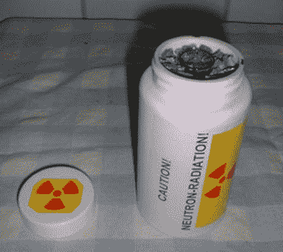

# DIY 核反应堆

> 原文：<https://hackaday.com/2011/08/06/the-diy-nuclear-reactor/>

“星期三，我被逮捕并被送进了监狱，”如果你决定尝试复制这个项目，你的博客可能会这么写。然而，你可能很幸运还在写你的博客，因为试图建造自己的反应堆可能相当危险。这就是[理查德]使用家用物品所做的，比如镭的时钟指针，镅的烟雾探测器。在放射性元素从他们的家庭“容器”中分离出来并熔化后，他们在他的炉子上制造了一次小爆炸。

这个尝试性的实验是基于[【大卫·哈恩](http://en.wikipedia.org/wiki/David_Hahn)】所做的一个实验，又名“核童子军”，为了获得他的核能徽章。值得一提的是，[大卫]确实获得了鹰级童子军的军衔，然而，在这个过程中，他把他父母的房子变成了超级基金环保局的清理场所。

休息后的视频描述了用家用材料制作反应器的过程。这个视频可能很有趣，但是不推荐复制它(而且会有点贵)。 [https://www.youtube.com/embed/i0TlECFbjvM?version=3&rel=1&showsearch=0&showinfo=1&iv_load_policy=1&fs=1&hl=en-US&autohide=2&wmode=transparent](https://www.youtube.com/embed/i0TlECFbjvM?version=3&rel=1&showsearch=0&showinfo=1&iv_load_policy=1&fs=1&hl=en-US&autohide=2&wmode=transparent)