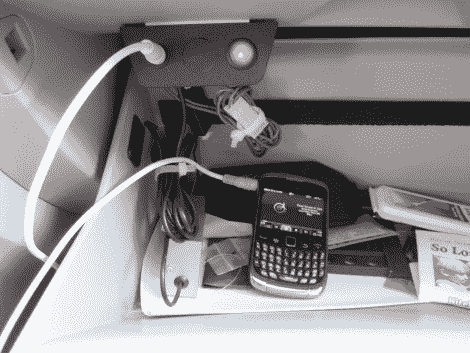

# 给现代索纳塔增加辅助音频输入的愚蠢行为

> 原文：<https://hackaday.com/2011/11/04/the-folly-of-adding-an-auxiliary-audio-input-to-a-hyundai-sonata/>

为什么辅助音频输入几十年来都没有成为汽车音响的标准配置，这是我们无法理解的。但你可以打赌，如果你正在寻找一个低价轿车，你将需要购买一个完整的升级包，只是为了获得仪表板上的音频插孔。[乔恩·W]现代索纳塔没有那种花里胡哨的升级，所以[他决定把他的立体声音响拿出来，加上他自己的辅助端口](http://jondontdoit.blogspot.com/2011/11/2007-hyundai-sonata-aux-input.html)。

这个黑客的一大部分只是让头部单元脱离仪表板。作为防盗功能，这是故意制造的困难，但[乔恩]明智地使用黄油刀似乎达到了目的。他一路上丢了一些小东西，后来用一个末端有双面胶带的烤肉串串找回来了。

主机出来后，他打开机箱，运用他专业的电子工程技能添加输入。他是想这么做的，但事实证明这里没有灵丹妙药。单元内部的设置没有提供简单的方法来焊接一个可以工作的输入。做完所有的拆卸工作后，他不会让它白白浪费掉。[乔恩]拿了一个很好的调频发射机设置。他在仪表板内部布线，并在手套箱中安装接口部件，如图所示。

很高兴知道我们不是唯一一个有时无法实现我们看似简单的黑客目标的人。至少[乔恩]能够重整旗鼓，并最终实现他所寻求的功能。