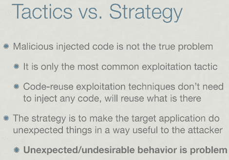

# 网络攻击的未来

> 原文：<https://hackaday.com/2011/02/04/the-future-of-cyberattacks/>

[Dino A. Dai Zovi] [在 2010 年早些时候发表了一次演讲](http://trailofbits.com/2010/11/10/memory-corruption-exploitation-and-you/)，他在演讲中分享了他对恶意利用的未来的看法。你可以[在 Ustream](http://www.ustream.tv/recorded/5167328) 上观看，他也在[上发布了一组与之配套的幻灯片](http://trailofbits.files.wordpress.com/2010/11/owasp_201011.pdf) (PDF)。我们觉得这个 48 分钟的视频很有意思。他没有深入世俗的细节，而是涵盖了更广阔的图景；过去做了什么，未来会发生什么，我们目前如何应对未来的威胁？最后一个问题在整个视频中都有涉及，但似乎又回到了这样一个概念，即我们陷入了术语和过去实践的窠臼，这阻碍了我们创新安全策略的能力，其速度与坏人想出下一个令人讨厌的东西的速度相同。