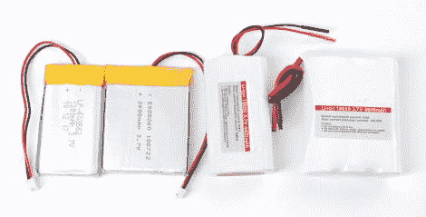

# 锂电池组的来龙去脉

> 原文：<https://hackaday.com/2011/05/25/the-ins-and-outs-of-lithium-based-battery-packs/>

因此，您已经构建了一个令人敬畏的项目，并准备随时使用它，但是您将如何为它提供动力呢？你可以使用几节碱性电池，或者从一些不常用的便携式设备上偷一个锂电池组——但是在这之前，为什么不[听听【Lady Ada】对这个话题有什么看法](http://www.ladyada.net/learn/lipoly/)？

她网站上的详细教程讨论了不同类型的锂电池及其外形，以及每种类型的优缺点。内容包括额定电压，以及选择适合当前任务的锂电池组的重要性。电池处理不当的危险显而易见，强调了选择合适的充电器和抵制将锂电池连接在一起以增加容量的冲动的重要性。

虽然大部分信息对我们的大多数读者来说并不新鲜，但对于那些刚刚开始在项目中使用锂电池技术的人来说，这绝对是值得一读的。