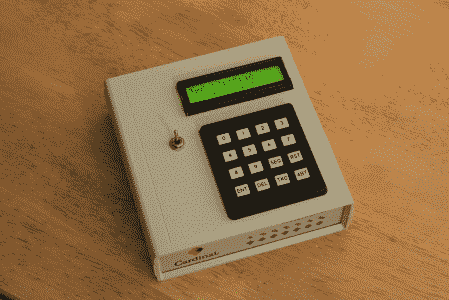

# 星际时钟

> 原文：<https://hackaday.com/2011/02/22/the-interstellar-clock/>

[亚历山大·阿夫坦斯基]组装了一个漂亮的[时钟来满足你所有的星际旅行需求](http://avtanski.net/projects/astro_clock/)。除了是另一个基于 PIC 的计时器，这是一个整洁的小项目，因为它包含了几乎所有你能想到的为我们的太阳系统建造时钟的功能。例如，它有 16 个独立的计时器和闹钟，可以同时给出多个行星的时间，以及跟踪其他恒星事件，如木星的眼睛或月亮的相位。为了启动这个项目，[亚历克斯]对一个旧的拨号调制解调器进行逆向工程，作为一个外壳和电源，然后添加一个可充电电池，这样他的星际时钟就不会绑在墙上。

[通过[使](http://blog.makezine.com/archive/2011/02/clock-built-for-extraterrestrial-travelers.html)