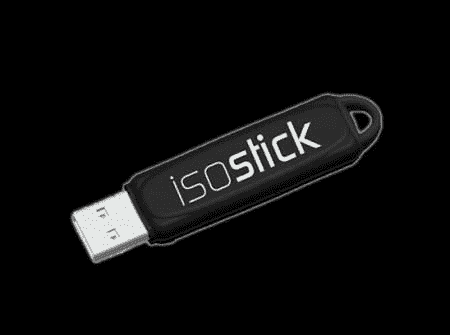

# 同位素棒

> 原文：<https://hackaday.com/2011/07/26/the-isostick/>

Kickstarter 目前正在开发的项目 iso stick T1 旨在模拟 u 盘形式的光驱。虽然将 iso 文件(光盘映像)放在 u 盘上并不是什么新鲜事，但这款硬盘的独特之处在于，它完全模拟了一个硬盘，而无需担心驱动程序或额外的程序。

插上电源后，计算机会看到一个闪存驱动器和一个虚拟光驱。一个优秀的特点是，这种磁盘可以存储多个“iso”文件，并选择他们与一个内置的实用程序。这对于技术人员或黑客来说是非常宝贵的，因为完成一项任务通常需要不止一张 CD 或 DVD。

如果完全开发出来，人们可以期望将这个“驱动器”附加到你的钥匙链上，再也不用担心拖着光盘到处跑了。此外，活动灯是可编程的，这是一个很好的奖励。