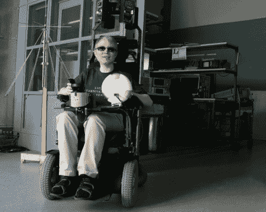

# 激光引导轮椅

> 原文：<https://hackaday.com/2011/06/02/the-laser-guided-wheelchair/>

瑞典吕勒奥科技大学开发的[新型轮椅](http://www.gizmag.com/sighted-wheelchair-taken-for-first-public-test-drive/18651/ "gizmag article")使用类似于工业安全系统中使用的扫描激光，允许视力受损者在没有帮助的情况下驾驶轮椅。驾驶员被给予触觉反馈作为导航辅助，据报道类似于使用拐杖。

虽然类似这样的东西在概念上是好的，但这个想法已经是一个工作原型了。博士生丹尼尔·因娜拉·阿尔马克(他自己也有视觉障碍)已经在他的大学繁忙的计算机科学、电气和空间工程系试运行了这个轮椅。测试结束后，何润说他“感觉就像使用一根白色的拐杖一样安全”

看到工程和黑客技术被用来帮助在某些方面有障碍的人真的很棒(看到一个视力有障碍的人帮助这个过程本身更酷！).更多关于帮助人们检查这个[大脑控制轮椅](http://hackaday.com/2010/12/10/eeg-the-locomotion/ ""EEG the Locomotion"")或者这个[儿童移动设备](http://hackaday.com/2010/11/10/robotic-mobility-for-the-little-ones/ "Robotic mobility for the little ones")的“技巧”。