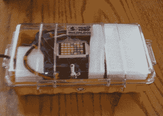
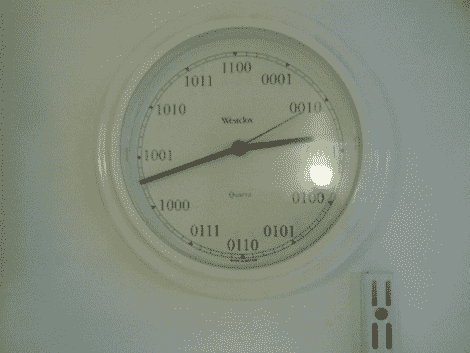

# 最复杂和最简单的二进制时钟。

> 原文：<https://hackaday.com/2010/01/18/the-most-complicated-and-simplest-binary-clocks/>

我们打算暂停张贴时钟。真的。这是今天收到的消息，我们不能错过。建造了可能是我们见过的最复杂的钟。至少，最初看起来是这样。这个[二进制时钟](http://brainlubeonline.com/binary_clock/Alexs_Binary_Clock!!.html#34)显示小时、分钟、秒、日和月。他从 picaxe 开始，但最终选择了 Mbed。是的，他知道这有点过了，但是效果很好。

至于最简单的，那也是我们的提示。[Toby]发来了这个，他同意我们的观点，认为它不值得被称为黑客。然而，鉴于上面那个复杂的问题，我们看不出张贴它的反面有什么害处。休息之后来看看。

没错，他只是打印了一张新脸。就像我们说的，没有比这更简单的了。