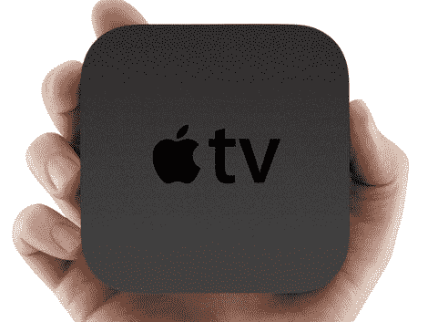

# 新款苹果电视

> 原文：<https://hackaday.com/2010/09/30/the-new-apple-tv/>

你可能已经听说过 Apple TV 2。它的零售价为 99 美元，在那个小小的包装中集成了高清视频、光学音频和 WiFi。但一如既往，我们喜欢它的可攻击性。尽管它才刚刚开始出货，黑客们已经蜂拥而至。该固件可从苹果的服务器上获得，并且[已经被解锁](http://www.mobilesdna.com/news/shatter-exploit-decrypts-apple-tv2-1-firmware-ios-4-1-successfully/1637/),还有待发布的粉碎漏洞。[Das_coach]甚至给我们发来了一个链接，链接到为 iPod touch 移植的[新前排的视频(在休息后嵌入)。](http://www.youtube.com/watch?v=RTJ5yG2LyX8)

但是圣杯一定是 XBMC。我们已经在第一代苹果电视上看过了，效果很好。第二代切换到[A4 处理器](http://en.wikipedia.org/wiki/Apple_A4)，这是一个 ARM Cortex-A8。不像第一代英特尔芯片那样容易移植。但是还是有希望的，2010 年谷歌代码之夏的一个项目成功地将 [XBMC 移植到另一个 ARM 设备](http://hackaday.com/2010/05/27/gsoc-takes-on-xbmc-on-the-beagleboard/)，这只是激励一些开发者去追求实现它的问题。我们已经等不及有一天我们可以把其中的一个 velcro 放在我们的电视后面，然后结束它，第一代 Xbox 不会永远存在。

[https://www.youtube.com/embed/RTJ5yG2LyX8?version=3&rel=1&showsearch=0&showinfo=1&iv_load_policy=1&fs=1&hl=en-US&autohide=2&wmode=transparent](https://www.youtube.com/embed/RTJ5yG2LyX8?version=3&rel=1&showsearch=0&showinfo=1&iv_load_policy=1&fs=1&hl=en-US&autohide=2&wmode=transparent)

[ [照片来源](http://www.hd-report.com/2010/09/01/new-apple-tv-features/apple-tv-2-hand/)