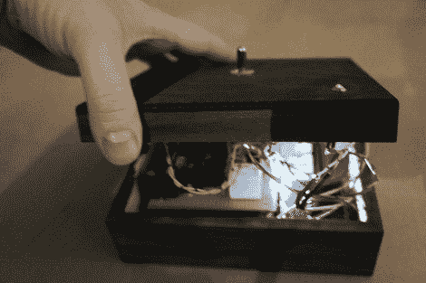

# 电话亭

> 原文：<https://hackaday.com/2012/01/24/the-phone-box/>

[Nerdindustries]有一个有趣的想法；"如果你能扳动开关打电话给某人会怎么样？"。这种情况经常发生，尤其是在你试图抓住某个总是被电话淹没的人的公司里。电话盒是一款基本的诺基亚手机，它的快速拨号中储存了一个号码。为了有助于交流，手机的输出被引导到一个 3.5 瓦的放大器模块，以确保你能听到。

一个延迟电路由一个基本的 RC 网络组成，所以当你按下开关时，手机有机会通电并完全启动。一旦延迟触发它按下快速拨号按钮，你就可以走了。现在已经有人问“你为什么不直接给他们打电话？”，我们从第一个回答“给某人打电话并不无聊”中得到启发

休息之后，请加入我们，观看一段简短的视频。

[https://player.vimeo.com/video/35517716](https://player.vimeo.com/video/35517716)