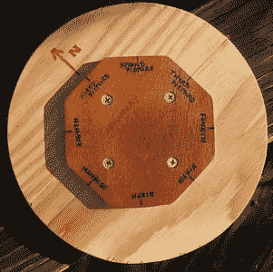

# 《图片邮报》——以极慢的动作观察你的世界

> 原文：<https://hackaday.com/2011/11/22/the-picture-post-observe-your-world-in-extreme-slow-motion/>

新罕布什尔大学正在进行的一个项目的工具“图片贴”是一种拍摄极端延时摄影的方法。这个项目的目的是用定期拍摄的 360 度视角观察你周围的世界。

[设置](http://picturepost.unh.edu/build.jsp)非常简单，由一个 9 英寸直径的柱子和一个八边形组成，用来放置你的相机。把你的相机放在一边，拍照，然后绕着八角形重复，直到完成。您可以在他们的网站上注册，使您的帖子成为官方的，并为社会提供关于环境和季节变化的一般知识。

虽然这个概念本身很有趣，但它可以应用于人们希望以这种方式记录的许多情况。例如，可以在黑客空间建立一个“黑客帖子”,让会员记录他们的项目，甚至是建筑本身的进展。对于另一种不太发达的拍照方式，看看这个使用空气清新剂部件的[触发装置](http://hackaday.com/2011/02/04/remote-camera-trigger-built-from-air-freshener-parts/)！

通过[【制作杂志】](http://makezine.com/)