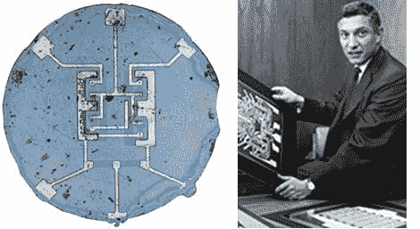

# 硅集成电路 50 周年

> 原文：<https://hackaday.com/2011/04/26/the-silicon-ic-50th-anniversary/>

今天是第一个硅集成电路专利 [50 ^(周年)日。](http://www.engadget.com/2011/04/25/today-marks-50th-anniversary-of-first-silicon-integrated-circuit/)我们不应该解释集成电路对这些人有多重要，但它是自面包片以来电子产品中最重要的东西。

[罗伯特·诺伊斯]在 1961 年 4 月 25 日^日获得了这项里程碑式的专利，然后继续创立了一家你可能听说过的鲜为人知的公司(和[戈登·摩尔]一起)，英特尔公司。他不是第一个发明集成电路的人，这项特权属于德克萨斯仪器公司的杰克·基尔比，尽管他的设计使用了锗晶片。与以前的技术相比，硅有许多优点，甚至在 50 年后，硅已经成为集成电路的主要技术，推动了电子、计算机和移动产业的发展。

看看上面的小文章，也一定要看看我们几个月前发布的这个关于 IC 构造的视频，它来自另一家公司【罗伯特·诺伊斯】帮助共同创立的飞兆半导体。