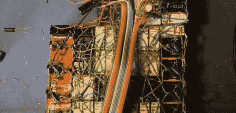

# TIM-8 是有史以来最小的 8 位中继计算机

> 原文：<https://hackaday.com/2012/01/16/the-tim-8-is-the-smallest-8-bit-relay-computer-ever/>

谁不想用继电器造一台电脑呢？是的，但是我们已经有太多的项目了。看起来[罗里]有他的优先次序，因为[他的构造](http://www.northdownfarm.co.uk/rory/tim/)是我们见过的最令人惊讶的之一。

我们已经看过[哈利·波特]的[惊人的中继计算机](http://web.cecs.pdx.edu/~harry/Relay/)，我们熟悉[康拉德·楚泽]的[二战时期的努力](http://en.wikipedia.org/wiki/Z3_(computer))。中继计算机并不罕见，但[rory]建造了 TIM-8，这可能是有史以来最小的 8 位中继计算机。与[哈利·波特]的 415 次接力相比，TIM-8 的总接力数是 152 次。这不是一个公平的比较，因为[Harry]的使用 4 极继电器，而 TIM-8 使用 1 极继电器，使[rory]的项目比[Harry]的小 8 倍。

有几个简洁的功能使 TIM-8 真正与众不同。TIM-8 的程序是用[rory]桌面上的文本编辑器编写的，然后编译并打印在收据纸上。TIM-8 有几个光电晶体管来读取印在纸上的黑白条纹。[rory]从继电器和灯泡组成的三位加法器发展至今。

休息过后，请观看大量视频。有几个程序演示在收据磁带上运行，计算斐波那契数列，并在中继声卡上播放“玛丽有一只小羊羔”。感谢[J. Peterson]发送这封邮件。

[https://www.youtube.com/embed/2q3_E8MxYdg?version=3&rel=1&showsearch=0&showinfo=1&iv_load_policy=1&fs=1&hl=en-US&autohide=2&wmode=transparent](https://www.youtube.com/embed/2q3_E8MxYdg?version=3&rel=1&showsearch=0&showinfo=1&iv_load_policy=1&fs=1&hl=en-US&autohide=2&wmode=transparent) [https://www.youtube.com/embed/nDJTVGIzOPU?version=3&rel=1&showsearch=0&showinfo=1&iv_load_policy=1&fs=1&hl=en-US&autohide=2&wmode=transparent](https://www.youtube.com/embed/nDJTVGIzOPU?version=3&rel=1&showsearch=0&showinfo=1&iv_load_policy=1&fs=1&hl=en-US&autohide=2&wmode=transparent) [https://www.youtube.com/embed/ND1wa-KisgY?version=3&rel=1&showsearch=0&showinfo=1&iv_load_policy=1&fs=1&hl=en-US&autohide=2&wmode=transparent](https://www.youtube.com/embed/ND1wa-KisgY?version=3&rel=1&showsearch=0&showinfo=1&iv_load_policy=1&fs=1&hl=en-US&autohide=2&wmode=transparent) [https://www.youtube.com/embed/zJ1i9b6cjSs?version=3&rel=1&showsearch=0&showinfo=1&iv_load_policy=1&fs=1&hl=en-US&autohide=2&wmode=transparent](https://www.youtube.com/embed/zJ1i9b6cjSs?version=3&rel=1&showsearch=0&showinfo=1&iv_load_policy=1&fs=1&hl=en-US&autohide=2&wmode=transparent)