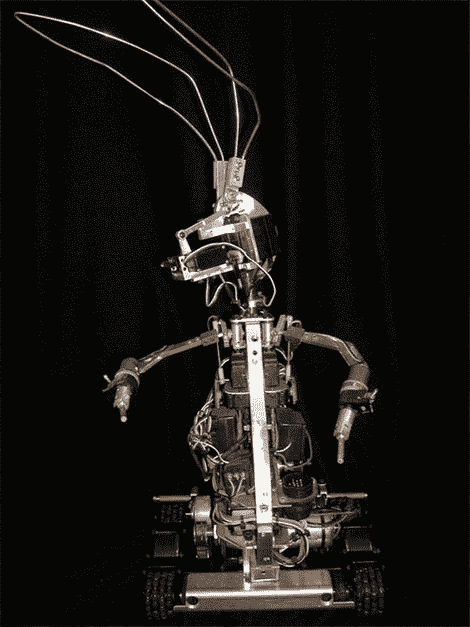

# 跨大西洋电池兔子分庭抗礼

> 原文：<https://hackaday.com/2010/04/07/the-trans-atlantic-battery-bunny-devide/>

这个[有点吓人的电枢](http://gizmodo.com/5510757/the-original-energizer-bunny-starting-at-15000)是标志性的劲量兔的底座。虽然我们喜欢看到流行机器人的内部，但这带来了一个有趣的事实。在欧洲，兔子是金霸王的象征。有一个有趣的故事，金霸王在欧洲已经使用兔子很多年了，只是在 1989 年激发 Energizer 在美国复制它们。这款很快就会在易趣上出售。

休息之后，请使用金霸王电池

[https://www.youtube.com/embed/kaF6FxmixJk?version=3&rel=1&showsearch=0&showinfo=1&iv_load_policy=1&fs=1&hl=en-US&autohide=2&wmode=transparent](https://www.youtube.com/embed/kaF6FxmixJk?version=3&rel=1&showsearch=0&showinfo=1&iv_load_policy=1&fs=1&hl=en-US&autohide=2&wmode=transparent)