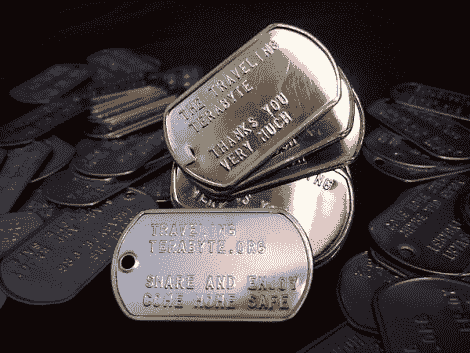

# 旅行太字节项目——帮助那些保护我们的人

> 原文：<https://hackaday.com/2011/03/11/the-traveling-terabyte-project-helping-those-who-protect-us/>

尽管有些人对“黑客”到底是什么有不同看法，但有一件事是可以肯定的——我们所属的这个由修补者、实验者和爱好者组成的全球社区是一个大心脏。通过我们的各种项目和教程，我们以身作则，分享知识并尽可能提供帮助。你很难找到比[旅行 TB 项目](http://deviating.net/ttb/)更能证明这一点的东西。

由[越轨 Ollam]于 2006 年夏天发起，该项目的目标是向部署在海外为美国武装部队及其相关人员服务的朋友和熟人提供 DefCon 14 的信息内容。这最初是通过为耐用的机箱配备装满电影、音乐和出版物的大型便携式硬盘来实现的，目的是帮助那些远离朋友和家人的人更好地享受他们的休息时间。

该项目飞速发展，而存储介质却相应缩小。该项目最近进入了一个新阶段，他们正在迁移到闪存驱动器，而不是硬盘驱动器，这将有助于极大地传播媒体的分布。

旅行太字节项目没有以任何方式向我们寻求金钱或宣传，所以你不应该觉得有义务支持这个项目。不管我们个人的政治倾向和对战争的看法如何，我们相信帮助那些远离他们的家、朋友和家人而承受巨大压力的人是一项崇高的事业。

[谢谢，RenderMan]