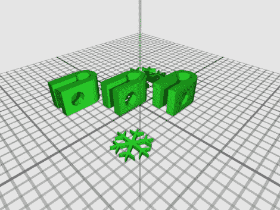

# 自我复制的十二天

> 原文：<https://hackaday.com/2010/12/08/the-twelve-days-of-self-replicating/>

好吧，更像是 23 天，但是谁会去数呢？[Kliment]在这个假日季节送出自我复制的礼物，每天上传[一个新的可打印部分](http://www.thingiverse.com/thing:5002)。如果你继续下去，并打印每一个，你将在圣诞节前得到一个 [Prusa Mendel](http://www.reprap.org/wiki/Prusa_Mendel) (这开始于 12 月 2 日，所以你需要赶上)。Prusa 是[Mendel](http://hackaday.com/2009/08/27/reprap-wedge/)的变体，尽可能使用衬套，将轴承的需求减少到两个。

所以，是的，你需要有一台 3D 打印机来制造这个 3D 打印机的零件，但这就是它的工作方式。[Kliment]已经竭尽全力让这个小练习变得有趣。需要更长时间打印的部分是为周末保留的，一些已经被修改以包括一个假日主题，所有这些都被优化以适应一个 [Makerbot](http://hackaday.com/2010/06/05/3d-printed-makerbot/) 构建平台。

[谢谢克里斯托弗]