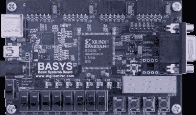

# 秘密的硬件挑战

> 原文：<https://hackaday.com/2008/08/21/the-underhanded-hardware-challenge/>

NYU 理工学院正在举办一场有趣的嵌入式系统竞赛。他们建造了一个使用 128 位私人密钥的固态加密设备。参赛者的任务是设计和实现几个木马到系统中，破坏系统的安全性。该系统建立在 [Digilent BASYS Spartan-3 FPGA 板](http://www.digilentinc.com/Products/Detail.cfm?Prod=BASYS&Nav1=Products&Nav2=Programmable)上。特洛伊木马可以做各种各样的事情:不加密传输，存储和传输以前输入的纯文本，或者完全关闭系统。尽管如此，改造后的设备仍然需要通过工厂测试程序，该程序将测量功耗、代码大小和功能。在一轮资格赛之后，参与者将获得必要的硬件来参加比赛。

【via [NYC 电阻](http://www.nycresistor.com/2008/08/20/polytechnics-embedded-system-challenge/)(生日快乐！)]

*   [永久链接](http://isis.poly.edu/csaw/embedded)