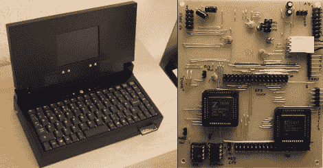

# V4Z80P:8 位笔记本电脑

> 原文：<https://hackaday.com/2010/11/08/the-v4z80p-the-8-bit-laptop/>

Retroleum 公司的[Phil]已经拼凑出了一台干净、组装良好的笔记本电脑,它完全基于一个[Zilog Z80](http://en.wikipedia.org/wiki/Zilog_Z80)微处理器和一对 Spartan II FPGAs。这些 FPGAs 使他能够减少电路板上的器件数量，从而降低生产成本和器件尺寸。他甚至设法整合了一个回收的 PSOne 屏幕。这台笔记本电脑配有[Phil]自己的自制操作系统以及一个基于图形矢量的演示。

当然，他近年来更新了项目，以缩小电路板，加快 Z80 的速度，增加外围速度和功能，但我们在这里是一个[整体包](http://hackaday.com/2010/11/07/project-enclosures-the-right-way/)黑客的吸盘。不过说真的，看看这个设备的[最新版本](http://www.retroleum.co.uk/v6z80p/)，以及显示这个项目随着时间的推移而增长的积压。

感谢[Steth]的提醒。