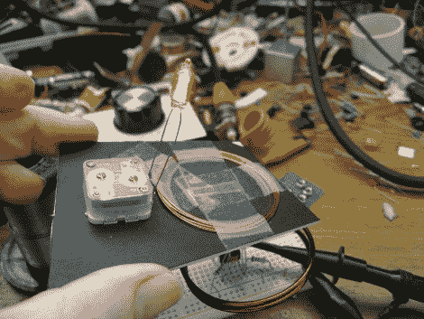

# 倏逝波耦合背后的理论，又名无线电源

> 原文：<https://hackaday.com/2011/01/14/theory-behind-evanescent-wave-coupling-aka-wireless-power/>

[Alan Yates]正在建造一个视觉暂留显示器，需要一种方法将电力从固定底座转移到旋转电路。他决定采用无线能量传输，并分享了他在开发过程中的所有研究和实验数据。它有两种形式，我们刚刚链接的书面版本，以及休息后嵌入的 37 分钟视频。如果你喜欢我们过去介绍过的一些[感应能量传输设备](http://hackaday.com/2009/11/18/look-ma-no-wires/)，【Alan 的】视频将通过结合使用说明性的示意性例子和对他建造的测试线圈的测量来告诉你为什么和如何。

[https://www.youtube.com/embed/r1UT4NuygmQ?version=3&rel=1&showsearch=0&showinfo=1&iv_load_policy=1&fs=1&hl=en-US&autohide=2&wmode=transparent](https://www.youtube.com/embed/r1UT4NuygmQ?version=3&rel=1&showsearch=0&showinfo=1&iv_load_policy=1&fs=1&hl=en-US&autohide=2&wmode=transparent)

【通过[被黑的小工具](http://hackedgadgets.com/2011/01/13/diy-wireless-power-transfer/)和 [EEVblog](http://www.eevblog.com/2011/01/04/wireless-power-transfer-transformer-tutorial/)