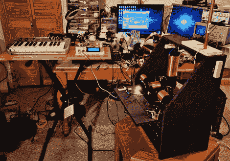

# 特雷门 Midi 板就像使用自动调音一样

> 原文：<https://hackaday.com/2011/02/08/theremin-midi-board-is-like-using-autotune/>

[史蒂夫·霍布里]建造了一个特雷门接口板，可以跟踪音高和音量。使用这种设置，他能够通过 midi 接口传递数据，有效地将乐器转换为非接触式 midi 控制器。正如我们在标题中开玩笑说的，这确实允许使用自动调音，通过将尖锐或平坦的音符吸附到最近的音高中心。但是你应该在休息之后观看视频，看看[史蒂夫]也展示了其他功能。键盘可以用来播种一个开始音高，根据特雷门琴的输入，在键盘上构建几个不同音调的琶音。

想知道细节吗？不幸的是，你必须为这些图表付钱。但是这个概念读起来还是很有趣的，即使你不知道什么进入了这个系统。

[https://www.youtube.com/embed/5sE2yS3CUno?version=3&rel=1&showsearch=0&showinfo=1&iv_load_policy=1&fs=1&hl=en-US&autohide=2&wmode=transparent](https://www.youtube.com/embed/5sE2yS3CUno?version=3&rel=1&showsearch=0&showinfo=1&iv_load_policy=1&fs=1&hl=en-US&autohide=2&wmode=transparent)