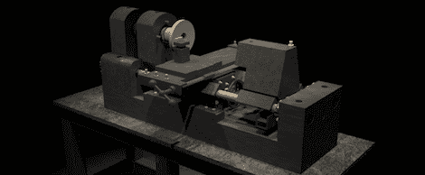

# 它们可能是为发展中国家准备的，但我们想要一台混凝土车床

> 原文：<https://hackaday.com/2011/09/27/they-may-be-for-developing-countries-but-we-want-a-concrete-lathe/>

在 2009 年的加纳创客节上，帕特·德拉尼遇到了一个年轻的木工学生，他攒了三个月的钱买了一架便宜的中国木飞机。他对这种资源分配感到困惑，因此[Pat]创建了[混凝土车床项目](http://concretelathe.wikispaces.com/)，旨在将有用的机床运送到最需要它们的地方。

混凝土机床的想法来自美国参与第一次世界大战。美国在投入战争之前一直是坚定的孤立主义者，武器的生产与所需的产量不匹配。一个名叫 L.I .约曼斯的人想出了建造混凝土车床来为战争生产炮弹的主意。

当然，混凝土车床项目在意图上更平和一些。混凝土车床对发展中国家来说是一种廉价的机床。混凝土车床和多功能机床都意味着使用废料廉价制造，减少机械师的培训时间，并以类似 Reprap 的生物分布创造其他机床。

混凝土车床 wiki 上有大量的文档，比如从宜家说明书上撕下来的[床身说明书，以及](http://concretelathe.wikispaces.com/How+To+Build+Part+1+-+Concrete+Bed)[螺纹随动件](http://concretelathe.wikispaces.com/How+To+Build+Part+7+-+Threading+With+A+Thread+Follower)。虽然他们还有很多工作和测试要做，但为那些最需要的人提供一些制造能力是一项非常崇高的事业。

感谢[Rob]发送这封邮件。