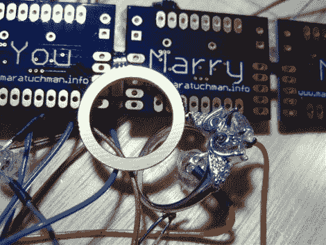

# 这个求婚是有史以来最好的 PCB 设计

> 原文：<https://hackaday.com/2011/09/08/this-marriage-proposal-is-the-best-pcb-design-ever/>

虽然你会经常在这个网站上看到以高压、火和金属为特征的黑客，但这并不意味着黑客、制造商和电子极客没有柔软的一面。事实上，我们发现在大多数情况下，事实恰恰相反。

以比尔·波特为例。

你可能已经看过他的[项目](http://hackaday.com/2010/12/21/clamp-sensor-power-monitoring/)和[教程](http://hackaday.com/2011/06/28/circuit-design-for-multiple-uart-connections/)一两次了，虽然我从未见过他，但他看起来是个好人[，他的心在正确的地方](http://hackaday.com/2011/06/06/million-volt-guitar-rocks-the-house-for-science/)。

他最近认定他的大学恋人是他的“唯一”，必须想出一个巧妙而令人惊讶的方式向一个总是领先一步的女孩求婚。[Mara(即将成为)Porter]正在做一个需要定制 PCB 的项目，之前从未订购过，[Bill]很乐意帮助她整理东西。在将原理图发送给位于 DorkbotPDX 的[【Laen】之后，【Bill】又发了一封电子邮件，要求将他的提案用丝网印刷在电路板上。[莱恩]说他很乐意帮忙，于是等待开始了。](http://dorkbotpdx.org/wiki/pcb_order)

几个星期后，电路板就到了，他们说，剩下的就是历史了。

怎么样了？我们猜想你现在已经明白了，但是一定要访问[Bill]的网站，看看它是如何进行的。

你知道你想…你这个大软蛋！