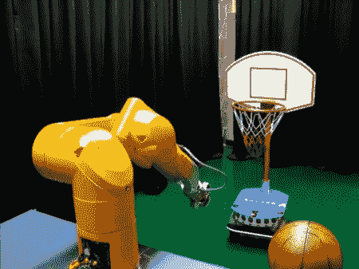

# 这个机器人会教你罚球

> 原文：<https://hackaday.com/2011/03/02/this-robot-will-school-you-at-freethrows/>

人们花费一生的时间在球场上练习，以获得这个机器人所达到的精确度。得益于对目标的立体摄像分析，它能够罚球。我们知道你在想什么；重要的是，它知道距离，这使得计算很容易。事实并非如此，仔细看看上图。篮子本身安装在一个机器人平台上，并创建一个随机移动的目标。看起来只有当篮筐静止不动的时候才会投篮。但这仍然意味着，当篮子不仅在不同的距离上，而且当它不在机器人的正前方并且不与机器人的手臂成直角时，系统能够计算出准确的投掷。准确性依赖于分析篮筐背板上的方块。因为两个摄像机给出不同的视角，所以两个图像的边缘和拐角检测允许系统推断目标的位置。

在折叠之后有一个向公众展示这个机器人的视频。显然，这个黄臂怪物不适合公众消费，因为开发者已经用一只毛绒海豹的身体覆盖了它。

[https://www.youtube.com/embed/aFl-9W8x-uI?version=3&rel=1&showsearch=0&showinfo=1&iv_load_policy=1&fs=1&hl=en-US&autohide=2&wmode=transparent](https://www.youtube.com/embed/aFl-9W8x-uI?version=3&rel=1&showsearch=0&showinfo=1&iv_load_policy=1&fs=1&hl=en-US&autohide=2&wmode=transparent)