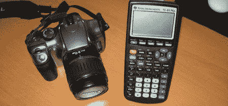

# TI-83 测距仪

> 原文：<https://hackaday.com/2008/06/09/ti-83-intervalometer/>

头条[如何用你的 DSLR 制作延时视频](http://digital-photography-school.com/blog/how-to-make-a-time-lapse-video-with-your-dslr/)并没有真正抓住我们。老实说，你花那么多钱买了一台相机，它开箱后就不能定时了吗？好吧，我们差点错过了真正的故事:[克里斯·马蒂诺]是[用 TI-83 作为相机的间隔计](http://www.instructables.com/id/Turn-a-TI-Graphing-Calculator-into-an-Intervalomet/)。计算器有一个 2.5 毫米的音频插孔作为数据端口，相机有一个相同的快门触发器端口。TI-83 运行一个带有 FOR 循环的程序作为计时器。当循环完成时，它向端口发送数据，电压触发快门。这个速率并不十分精确，并且会随着电池剩余电量的不同而变化。[Chris]估计 10000 次程序迭代结束时，图片之间的间隔约为 26 秒。这项技术也在 84、86 和 89 系列计算器上进行了测试。在广告之后有几个延时视频的例子。

<http://www.flickr.com/apps/video/stewart.swf?v=49235>

<http://www.flickr.com/apps/video/stewart.swf?v=49235>

【via】life hacker

*   [永久链接](http://www.instructables.com/id/Turn-a-TI-Graphing-Calculator-into-an-Intervalomet/)