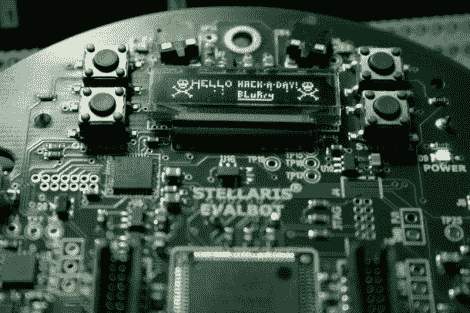

# TI 为 Evalbot 增加了一些 Linux 支持–我们为您提供了硬件优惠券代码！

> 原文：<https://hackaday.com/2011/04/05/ti-adds-some-linux-support-for-evalbot-weve-got-hardware-coupon-codes-for-you/>

如果你错过了，德州仪器公司出售一种叫做 Evalbot 的小机器人，作为 ARM Cortex-M3 微控制器的开发平台。自从它发布以来，我们已经看到了一些硬件上的黑客攻击；上图是在 Linux 下为设备开发的[的概念证明。我们过去批评 TI 没有用他们的 ide 支持 Linux。我们不知道它会如何发展，但他们已经添加了新的软件包选项来搭配硬件。你会注意到](http://hackaday.com/2011/02/02/ti-evalbot-development-under-linux/)[在他们的公关页面](http://focus.ti.com/mcu/docs/mcuorphan.tsp?contentId=114871&DCMP=evalbot-2&HQS=Other+PR+evalbot-2-pr-tf)上，现在有一个使用 CodeSourcery 的选项。这是一个完整版本的试用版，但至少这是他们向 GNU 方向迈出的一步。

Hackaday 团队一直在断断续续地与 TI 讨论硬件问题。我们很高兴地说，他们一直在倾听互联网社区关于他们的好恶；关注各种在线群组，讨论 Evalbot 项目。听起来他们在考虑用硬件举办一场比赛。因此，也许你想得到一个，这样你就可以熟悉自己，并在比赛开始时立即投入比赛。你很幸运，我们可以帮你节省一些钱。

德州仪器(Texas Instruments)第一次尝试 125 美元的优惠券代码,这笔交易从他们手中溜走了。这是为 ESC 波士顿会议的与会者准备的。他们尊重在众所周知的银行挤兑关闭之前达成的交易。这一次，他们使用序列化交易代码来限制赠送的数量。我们已经有 200 本等着我们的忠实读者使用。一个代码可以让你只花 25 美元(而不是 150 美元)购买一个 Evalbot。

请花一点时间来决定你是否真的想要(并将使用)其中一个机器人，并决定你是否愿意支付 25 美元来订购它。你看，我们不想浪费这笔交易。~~如果你决定这是给你的，发送一封电子邮件要求一个代码到:~~ **我们都出来了！我们将按照先发邮件先服务的原则分发交易。当所有 200 人被认领后，我们将更新这个帖子。**

我们不会容忍任何人玩弄系统，所以我们保留以任何理由取消任何电子邮件提交资格的权利，以试图保持某种程度的公平。此外，如果你打算把它捡起来，然后卖掉换钱，那你就是个失败者。

[更新:那些给我们发邮件要求代码的人应该会在今晚或明天收到回复。]

[更新 2: [这是你应该尝试购买的特定机器人](https://estore.ti.com/Search.aspx?&detail=1&k=EKI-EVALBOT)。]