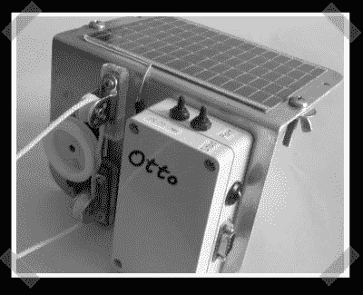

# 小型帆船舵杆自动驾驶仪

> 原文：<https://hackaday.com/2008/04/19/tiller-autopilot-for-small-sailboats/>

【丹尼斯】送来[【阿特】造的滑翔机](http://www.members.shaw.ca/sonde/)，但我不得不展示他的[小艇自动驾驶仪](http://artvb.oatmeal.dhs.org/Project/10/tiller-pilot-for-dinghy-cruising)。它依靠太阳能运行，通过串口获取 GPS 数据，并使用伺服电机驱动线路来保持航向。对于硬件黑客来说，这是一个很好的解决方案。

*   [永久链接](http://artvb.oatmeal.dhs.org/Project/10/tiller-pilot-for-dinghy-cruising)