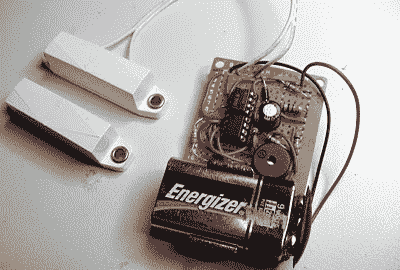

# 延时门报警

> 原文：<https://hackaday.com/2010/03/06/time-delay-door-alarm/>

有没有不小心让你的前门半开着，让一只宠物逃走了？[BlackCow]想出了一个简单的方法来解决这个问题。该电路相当简单，但却是使用基本原理完成工作的一个很好的例子。现在，他没有一开门就发出警报，而是有 30 秒的延迟。这有助于避免“喊狼来了的男孩”效应，也称为“vista 安全警告”效应，因为一个无关紧要的问题被打扰太多次。我们还得说，我们喜欢他在博客布局上的品味。

[via [被黑的小工具](http://hackedgadgets.com/2010/03/05/time-delay-door-alarm-project/?utm_source=feedburner&utm_medium=feed&utm_campaign=Feed:+HackedGadgets+(Hacked+Gadgets))