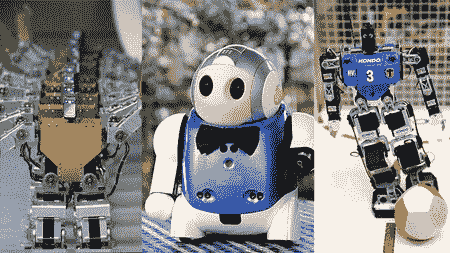

# 时代杂志最喜爱的机器人

> 原文：<https://hackaday.com/2008/07/01/time-magazines-favorite-robots/>

《时代》杂志最近贴出了一张他们最喜欢的机器人的[照片。这篇文章是对皮克斯电影](http://www.time.com/time/photogallery/0,29307,1815874,00.html)[瓦力](http://www.mahalo.com/Wall-E)最近上映的回应，其中展示了世界上一些最可爱、最令人想抱的机器人。我们更感兴趣的是最实用的，尽管很难拿。休息之后看看这些黑客老手。

<http://www.youtube.com/v/3ju4upwhdvM&amp;hl=en&amp;rel=0&amp;color1=0x3a3a3a&amp;color2=0x999999>

  
其中引起我们注意的是影机器人公司的[影手](http://www.shadowrobot.com/hand/)我们最早的[贴在 2005 年](http://www.hackaday.com/2005/05/24/shadows-dexterous-hand/)。尽管它的名字，这个机器人不是为邪恶而设计的，而是模仿人手的最好的机器人。它由 40 多块空气肌组成，这些空气肌是由一根橡胶管和一个柔性塑料网组成的柔性装置。空气肌提供握紧和松开手所需的拉力。

一个更先进的机器人是拟人化的 [HOAP-3](http://jp.fujitsu.com/group/labs/downloads/en/business/activities/activities-4/fujitsu-labs-robotics-005-en.pdf) (PDF 文件)，它可以走路，说话，戴上一顶高高的厨师帽也很好看。更重要的是，可以教会机器人执行简单的任务；[在视频](http://www.hackaday.com/2008/05/24/the-chief-cook-robot/)中，瑞士洛桑联邦理工学院的一组研究人员通过简单演示教会了 HOAP-3 如何在搅拌碗中搅拌鸡蛋。

一个厨师机器人可能令人印象深刻，但机器人牧师简直让我们大吃一惊。这是描述 [Tiro](http://www.tiro.co.kr/) (网站是韩语)的最佳方式，这个机器人曾被用来主持其创造者之一的婚礼。Tiro 被设计成一个通用的助手机器人，能够播放音频，自行移动，手臂携带物体，并在其 LED 脸上显示各种面部表情。所有这些能力使泰洛非常适合完成基本的社会任务，尽管我们不确定他们是否都是被任命的牧师，或者只有上图中的人是这样。

点击下面的链接，查看一些更可爱、更实用的机器人，看看你最喜欢的机器人是否榜上有名。

[使用前通过[摇匀](http://www.shakewellbeforeuse.com/2008/07/time_magazine_aroused_by_robot.php)

*   [永久链接](http://www.time.com/time/photogallery/0,29307,1815874,00.html)