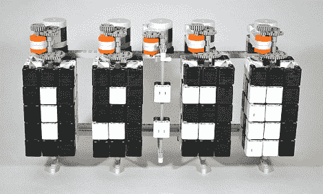

# 时间扭曲者是一个巧妙的乐高时钟

> 原文：<https://hackaday.com/2011/11/02/time-twister-is-an-ingenious-lego-clock/>

这里有一个有趣的乐高时钟，它使用旋转方块来改变黑白瓷砖的方向，以显示所需的数字。当我们在广告之后看到视频中的一个数字循环到下一个数字时，一些不同的事情浮现在脑海中。这看起来非常像一个一维的魔方，它也暗示了一个非常大的电子纸显示器。那些使用磁场来旋转一面是黑色一面是白色的微球体。

这款由[汉斯·安德森]制造的时计仅限于显示数字。想想看，每行有三个像素，但你不需要所有这些像素的组合都可以显示数字。四边为必要的组合提供了足够的空间。如果您试图将它扩展到包含所有字母数字字符，这就不是真的了。

这东西的滴答声听起来很有趣，是吧？

[https://www.youtube.com/embed/A_mA72r3ZiQ?version=3&rel=1&showsearch=0&showinfo=1&iv_load_policy=1&fs=1&hl=en-US&autohide=2&wmode=transparent](https://www.youtube.com/embed/A_mA72r3ZiQ?version=3&rel=1&showsearch=0&showinfo=1&iv_load_policy=1&fs=1&hl=en-US&autohide=2&wmode=transparent)

[谢谢迈克尔]