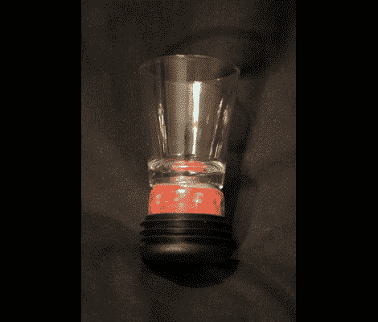

# 定时酒杯不会让你停止饮酒

> 原文：<https://hackaday.com/2011/03/01/timed-shot-glass-wont-let-you-stop-drinking/>

[Drewbagd]受到 555 计时器竞赛的启发，决定将它作为自己的第一个电子项目。这是一款名为“权力时刻”的饮酒游戏的配件。这个游戏(如果你可以这样称呼它的话)包括参赛者在一个小时内每分钟喝一杯啤酒。[Drewbagd]指出，计时可能是一个问题，因此他决定为每个酒杯增加自己的计时器。

他增加了一个底座，由一圈围绕着 555 定时器的发光二极管、盖子和电阻组成。这导致计时器从点亮几秒钟(饮用)到熄灭一分钟(重新注满)振荡。他称之为动力时间。广告之后的视频展示了它的功能，并暗示了作为一名电视商业节目主持人的光明前景。

他有一个[支撑柱](http://poweredpowerhour.wordpress.com/2011/02/28/how-it-performs/)，详细说明了电子设备并概述了一些原型问题。我们很高兴听到当他陷入困境时，他在 Hackaday 的论坛上找到了帮助[。感谢所有通过分享知识参与社区的人。](http://forums.hackaday.com/viewtopic.php?f=4&t=190)

[https://www.youtube.com/embed/wBLT1606mSA?version=3&rel=1&showsearch=0&showinfo=1&iv_load_policy=1&fs=1&hl=en-US&autohide=2&wmode=transparent](https://www.youtube.com/embed/wBLT1606mSA?version=3&rel=1&showsearch=0&showinfo=1&iv_load_policy=1&fs=1&hl=en-US&autohide=2&wmode=transparent)