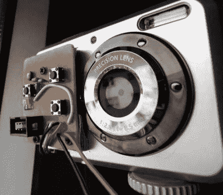

# 用于傻瓜相机的定时电路

> 原文：<https://hackaday.com/2010/11/23/timelapse-circuit-for-point-and-shoot-cameras/>

[Andyk75]做了一些了不起的工作，记录了他在数码相机上添加的[延时装置](http://www.instructables.com/id/Time-lapse-add-on-to-a-Rollei-digicam/)。大多数更贵的型号的相机都有遥控快门，但傻瓜相机通常没有。他决定增加开机、拍照、关机的功能。很聪明，因为这些东西如果开着的话会很快耗尽电池。他的大脑使用的是 ATtiny24，但是这个电路应该可以很好地适应其他人。最后一件作品有几个特点，比如能够改变拍摄之间的时间长度，并在外面太暗无法继续时自动关闭。如果你能在说明书的广告中找到原理图和电路板布局图，他已经贴出来了。休息之后，你可以看看用这台相机拍摄的日落视频。

[http://www.youtube.com/watch?v=kV6Lg__62j8&w = 470](http://www.youtube.com/watch?v=kV6Lg__62j8&w=470)