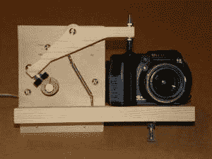

# 所有人的延时照片！

> 原文：<https://hackaday.com/2011/01/04/timelapse-photos-for-all/>

发现自己想做一些定时拍摄，但缺乏设备？为什么不像[建造者]在[instructables how to](http://www.instructables.com/id/Timelapse-Photos-With-Your-Camera-The-Easy/)中看到的那样建造你自己的定时拍摄装置。要做到这一点，你只需要一点木头、螺丝钉、一个马达和一些电池。该指南说，你可以增加额外的电压来加快拍照速度，或者相反地降低电压来减慢拍照速度。我们尤其喜欢这种机械方法的简单性。没有计时器，没有程序，只有一个马达。然而，这种简单方法的一个缺点是，随着电池电量的耗尽，图片之间的“间隙”会增加。

[https://www.youtube.com/embed/WkMj3JoKdXg?version=3&rel=1&showsearch=0&showinfo=1&iv_load_policy=1&fs=1&hl=en-US&autohide=2&wmode=transparent](https://www.youtube.com/embed/WkMj3JoKdXg?version=3&rel=1&showsearch=0&showinfo=1&iv_load_policy=1&fs=1&hl=en-US&autohide=2&wmode=transparent)43.002684-81.21499