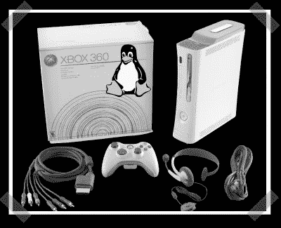

# 定时攻击 XBox 360 内核降级

> 原文：<https://hackaday.com/2007/09/22/timing-attack-xbox-360-kernel-downgrade/>

【Xantium】从 XBox 现场了解最新情况。这个攻击只是一个[概念验证](http://www.hackaday.com/2007/08/25/new-xbox-360-downgrade-hack/)现在是一个完全公开的黑客。[Robinsod]发布了[关于如何执行“定时攻击”的细节](http://www.xbox-scene.com/xbox1data/sep/EEApuFVAEZoyUVvULE.php)，以便将 360s 内核降级为可黑客攻击的版本。黑客需要一个 infectus mod 芯片，一个围绕 16F876A 构建的 [PIC 接口](http://www.xbox-scene.com/xbox1data/sep/EEAppApuZFfHEXVbcp.php)和一个软件包来启动。重要的是，你现在可以将你的 360 从任何内核降级到可利用的版本。考虑到之前的限制，这对于家酿爱好者来说是非常令人兴奋的消息。

*   [永久链接](http://www.xbox-scene.com/xbox1data/sep/EEApuFVAEZoyUVvULE.php)