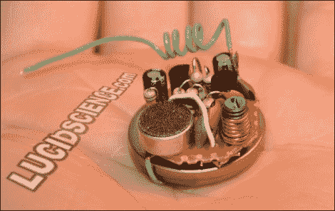

# 微型调频发射机窃听器室

> 原文：<https://hackaday.com/2010/10/21/tiny-fm-transmitter-bugs-rooms/>

Lucid Science 利用这个[微型调频发射机](http://www.lucidscience.com/pro-basic%20spy%20transmitter-1.aspx)再次深入研究间谍技术。他们的帖子展示了一个比上面看到的更大的版本，使用了 9 伏电池和尺寸匹配的原型板，这使得焊接更容易。该设计使用了一个麦克风、两个晶体管、漆包线线圈以及各种电阻、电容和电位器。你最终得到的是一个非常清晰的音频信号，可以用普通的调频收音机接收。

这对孩子们来说是个很好的项目。你可以谈论电路设计，练习焊接，完成后，他们会得到一个几乎不可思议的玩具。在家里说话要小心，房间可能被窃听了！