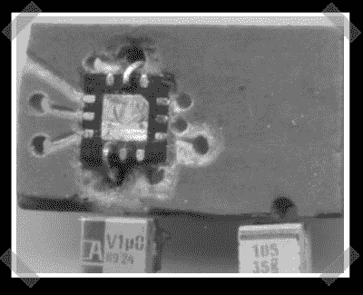

# 微型内置耳机放大器

> 原文：<https://hackaday.com/2007/08/20/tiny-inline-headphone-amp/>

【杰西】[送来了这个](http://www.instructibles.com/id/E4G3WOHF54HMECV/)耳机放大器。它实际上只是一个带有专用 smd 耳机放大器芯片( [MAX9725](http://www.maxim-ic.com/quick_view2.cfm/qv_pk/4523) )和一对从旧硬盘回收的 smd 电容的电路板，但它确实可以工作。我认为目标是增强低信号，而不是发烧友通常追求的更干净的音乐。

*   [永久链接](http://www.instructibles.com/id/E4G3WOHF54HMECV/)