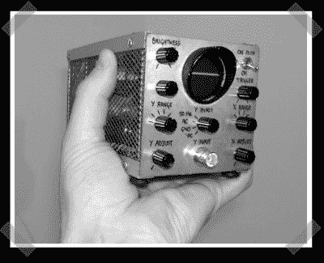

# 微型示波器

> 原文：<https://hackaday.com/2007/07/30/tiny-oscilloscope/>

[这个](http://www.hanssummers.com/electronics/equipment/tinyscope/index.htm)小 o-scope 完全是用阀门(管子)建造的，由【伊恩·威尔逊】和【汉斯·萨默斯】建造。【汉斯】’[网站](http://www.hanssummers.com/index.htm)涵盖了从[监视器去内脏](http://www.hanssummers.com/misc/recycling/monitor/index.htm)到 [Z80 粘度计](http://www.hanssummers.com/electronics/viscometer/index.htm)的一切，值得花些时间逛逛。感谢[Elliot]在[提示行](http://hackaday.com/tips)发送这一条。

*   [永久链接](http://www.hanssummers.com/electronics/equipment/tinyscope/index.htm)