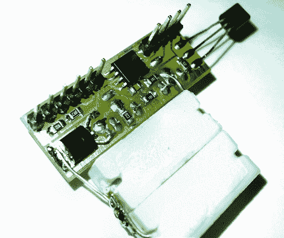

# 微型电源监控器

> 原文：<https://hackaday.com/2010/02/09/tiny-power-supply-monitor/>

【Manekinen】[围绕一款 AVR ATtiny13 打造了一款电源监控器](http://translate.google.com/translate?hl=en&sl=pl&tl=en&u=http%3A%2F%2Fwww.elektroda.pl%2Frtvforum%2Fviewtopic.php%3Fp%3D7661111)。电压和安培数显示在 16×2 LCD 字符显示器上(我们不确定第三个数字是什么…每秒采样数？).考虑到 tiny13 是一款 8 针芯片，这可不是一个小壮举。他通过将引脚用于 LCD 控制和 ADC 输入来实现这一点。为此，兼容 HD44780 的显示器采用 4 位模式。休息后查看视频，如果您想下载源代码和 PCB 插图，请点击[未翻译的页面](http://www.elektroda.pl/rtvforum/viewtopic.php?p=7661111#7661111)。需要注意的是，他使用 I/O 的 RESET 引脚，这意味着一旦你烧断保险丝，如果你想重新编程芯片，你需要一个具有高压串行编程能力的[编程器。](http://hackaday.com/2009/03/13/avr-hv-rescue-shield/) [https://www.youtube.com/embed/7n9F4LuwhvM?version=3&rel=1&showsearch=0&showinfo=1&iv_load_policy=1&fs=1&hl=en-US&autohide=2&wmode=transparent](https://www.youtube.com/embed/7n9F4LuwhvM?version=3&rel=1&showsearch=0&showinfo=1&iv_load_policy=1&fs=1&hl=en-US&autohide=2&wmode=transparent)

[感谢 RicoElectrico]