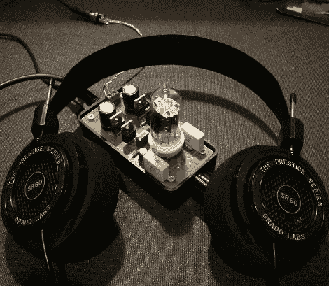

# 耳机用微型电子管放大器

> 原文：<https://hackaday.com/2010/04/13/tiny-tube-amp-for-headphones/>

我们喜欢时不时地查看临时搭建的电子管放大器场景。[罗杰斯·戈麦斯]最近发布了他制作的[耳机电子管放大器](http://diyaudioprojects.com/Solid/12AU7-IRF510-LM317-Headamp/)。这与【2008 年的作品有些关联，但这一次它足够简单，可以作为初学者进入放大器构造的入门。PCB 布局简洁明了，便于电路板蚀刻，而且它足够小，可以放入外壳中，作为耳机配件。只需要一根管子，总零件费用约为 50 美元。如果你制作了它，在冒险插入你的珍贵耳机之前，注意他关于用一副廉价耳机测试的建议。

仍然想要一个放大器，但不在乎源真空管？[Giovanni]提交了最初的提示，不久前制作了一个，并[将其存放在外部 CD-ROM 外壳中](http://hackaday.com/2008/07/01/external-cd-rom-turned-class-a-headphone-amp/)。