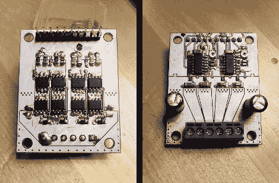

# Tinywrench 用 ATtiny24 芯片控制电机

> 原文：<https://hackaday.com/2011/10/09/tinywrench-controls-motors-with-attiny24-chips/>

Tinywrench 是[Tanjent 的]在一个电机控制器板上。它旨在以尽可能低的成本复制独立电机控制器芯片提供的所有功能。初步结果出来了。它的工作原理，正如所见，可以组装约 8 美元。

设备顶部提供了一个接线盒，用于连接电机、接地和 24V 输入。底部的引脚头有所有你期望找到的步进电机驱动板的连接。回头看顶部还有一对 ATtiny24 芯片，每个芯片都有自己的 trimpot 来平衡恒流输出。电路板下侧隐藏着两个 H 桥，使用高端和低端 MOSFETs 以及一些二极管进行保护，并使用各种无源元件来驱动它们。

就目前情况来看，每个 H 桥可以处理大约 9 安培的电流，这对于小型电机项目来说应该绰绰有余。[Tanjent]提到，使用它而不是单个电机驱动器芯片的主要优势之一是，如果你烧坏了一个 MOSFETs，你可以更换它，而不是毁掉整个电路板。