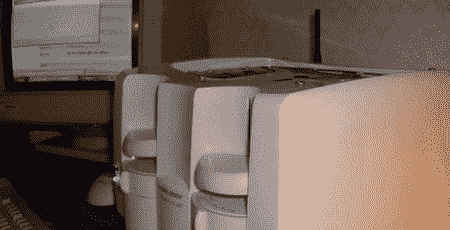

# 烤面包机计算机

> 原文：<https://hackaday.com/2008/09/07/toaster-computer/>

[戈登·约翰逊]最近完成了他的烤面包机项目的第一部分。他使用了一个标准的四槽烤面包机作为外壳，并切割了一些孔来接入端口和无线天线。虽然没有提到所用组件的规格，但在他的网站上有很好的记录，包括大量的图片和视频。虽然他在建筑的第一部分使用了传统的基于风扇的冷却方法，但他计划在第二部分使用特殊的冷却方法，使用铝和矿物油来创造[热电冷却](http://en.wikipedia.org/wiki/Thermoelectric_cooling)效果。