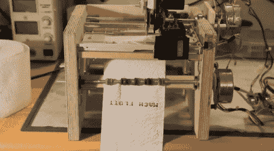

# 用废弃零件制成的卫生纸打印机

> 原文：<https://hackaday.com/2011/09/27/toilet-paper-printer-made-from-scrap-parts/>

我们最喜欢的一些黑客是用废料制成的，所以我们很高兴看到德国技术杂志《c't》举办的一场竞赛，该竞赛侧重于使用回收的组件。“Mach flott den Schrott”是比赛的名称，大致翻译为“快速报废”。

德国建筑商【马里奥·卢卡斯】[参赛](http://www.mariolukas.de/2011/09/mach-flott-den-schrott-toilettenpapier-drucker/) ( [谷歌翻译](http://translate.google.com/translate?hl=en&rurl=translate.google.com&sl=de&tl=en&twu=1&u=http://www.mariolukas.de/2011/09/mach-flott-den-schrott-toilettenpapier-drucker/))绝对是独一无二的，当然也符合主题。他制造了一台卫生纸打印机，用一堆回收的部件在一卷柔软的白色材料上写下他想要的任何东西。他的博客介绍了构建细节，包括他用来组装的所有废料的材料清单。一些光盘驱动器、打印机，甚至直排轮滑鞋都向打印机捐赠了一些组件，而一个 Arduino 则控制着整个打印过程。

尽管[马里奥]正在使用 RSS 和 Twitter feeds 作为他厕所边脚本的数据源，但我们认为，广告公司抓住这种技术来创建面向绝对被俘虏的观众的个性化广告只是时间问题。

继续阅读，看看他的卫生纸打印机在行动的快速视频。

[通过[使](http://blog.makezine.com/archive/2011/09/toilet-paper-printer.html)

[https://www.youtube.com/embed/2Qa-78bxgMM?version=3&rel=1&showsearch=0&showinfo=1&iv_load_policy=1&fs=1&hl=en-US&autohide=2&wmode=transparent](https://www.youtube.com/embed/2Qa-78bxgMM?version=3&rel=1&showsearch=0&showinfo=1&iv_load_policy=1&fs=1&hl=en-US&autohide=2&wmode=transparent)