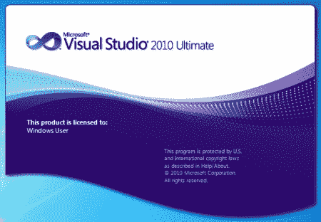
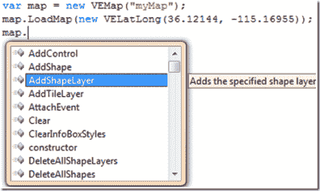
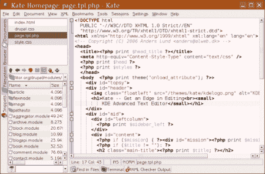

# 五大集成开发环境

> 原文：<https://hackaday.com/2010/08/24/top-5-integrated-development-environments/>

所以，你想做一些编程，但没有大公司的预算？这正是您需要的，因为所有这些开发环境都是免费的！许多集成开发环境面向有钱支付这种昂贵环境的公司。以下是使用和认可最广泛的五大集成开发环境。有些会在编程过去和未来教程的时候用到。下面列出的没有特别的顺序，都是很好的开发环境。

还有很多 IDE 没有被提及，但是应该被提及。我们在 Hack A Day Answers [上提出了这样一个问题:“你最喜欢的 5 个 IDE 是什么？”](http://bit.ly/Top5IDE)请给我们一些反馈，我们将根据您给我们的评论提供一份修改后的列表！

**[Visual Studio Express](http://www.microsoft.com/express/)**

Visual Studio 在编程方面有优势。这个 IDE 大部分是企业程序员用来生产的。NET 代码。有时人们想先试用产品而不投资几千美元，所以微软有他们所有产品的速成版。这对于那些想把编写代码作为业余爱好的普通用户或者需要免费 C#解决方案的程序员来说是完美的。不过要注意的是，如果有人使用 Visual Studio 的 express 版本开发的应用程序起飞并开始赚钱，那么看到老大哥介入并开始提出问题就不足为奇了。

*   优势
    *   智能感知
        *   对于那些不知道什么是智能感知的人，这里有一个简单的概述。智能感知是微软的编程方式。尽可能不痛不痒。当您在 Visual Studios IDE 中开始编程时，您会注意到当您开始在 IDE 中键入任何内容时会出现一个建议框，这是为了通知用户有哪些方法和函数可用(R.I.P. Clippy)。当点击建议框中的一个方法时，环境会准确地告诉你这个方法要做什么，需要多少和什么参数。基于 intellisense 决定使用什么函数和方法的能力是一个强大的功能，许多人会发现它很有用，如果不是改变生活的话。

*   骗局
    *   CPU 猪
        *   运行 Visual Studio 时，必须有足够的内存空间。说到开发应用程序，这是一个很好的理由。如果你冒险牺牲 RAM 来运行这个 IDE，你就拥有了最全面的 GUI 之一(一旦你学会了使用它)。NET 框架。
    *   压倒性的 GUI
        *   如果您以前从未使用过 Visual Studio，那么您将会大吃一惊。当第一次启动时，按钮和窗格的布局可能会有点/非常混乱。这需要时间来适应，所以失败是有一个陡峭的学习曲线与布局。
    *   费用
        *   Visual Studio 专业版售价 1000 美元(不含 MSDN 订阅),如果您正在寻找更多功能和订阅，价格还会更高。这可能是一个真正的爱好者关闭，但这是快速版本将成为救赎。

**[月食](http://www.eclipse.org/downloads/)**

如果你不是微软 Visual Studio 的忠实粉丝，这是最好的选择。该接口比 Visual Studio 干净简洁得多，可以使用的语言也超越了。Net 框架。除了通过 Android SDK 开发 Android 应用程序之外，它还可以完全扩展到使用 Ruby、C、C++等语言。

*   优势
    *   语言扩充性
        *   上面提到的语言不受微软的限制，任何人都可以自由地开发不同语言的插件，并使开发环境更易于使用。此外，对于许多不喜欢被微软的操作系统束缚，喜欢完全控制自己的操作系统的人来说，在 Linux 上使用它的能力是一个巨大的诱惑。
    *   自由的
        *   除了完全可定制和可扩展之外，eclipse 的第二大优点是它是免费的。对于业余爱好者和想在空闲时间编写一些代码的临时程序员来说，这是个好消息。
    *   编译代码
*   骗局
    *   陡峭的学习曲线
        *   有了这么多可以升级和添加的东西，eclipse 的学习曲线将会非常陡峭。解决这个问题的最好方法是尝试编码。编码时犯错误从来没有这么有益。一旦你开始从你的错误中学习，你将学会最快的方法来完成你想做的事情。

**[Netbeans](http://netbeans.org/downloads/)**

是月食的头号替代品。这个程序是可扩展的和免费的，它编译代码是一个额外的收获。安装 Netbeans 时，它附带了一个名为 GlassFish 的 Java 服务器，您可以将它部署在您的计算机上，用于您的测试环境。该服务器是仅次于 WebSphere 的第二大 Java 服务器(这是一个完全不同的领域)。

*   优势
    *   可扩张的
        *   同样，可扩展性是开发环境生存的必备条件。将多种不同语言的多个程序组合成一个程序得到了开发人员的认可，而将所有程序组合在一起的软件程序得到了更多的使用，这是因为开发人员希望简单、方便地访问这些语言。
    *   编译代码
    *   自由的
*   骗局
    *   傲慢的
        *   在使用这个程序的时候，你可能会注意到你的电脑变慢，在你的程序中抛出你不知道存在的错误等等。这是一个很难掌握的软件程序，编码时你必须小心谨慎。对您来说可能不是这样，Netbeans 可能是阳光和彩虹，但最好是安全的，而不是在您有数百个项目时后悔。

**[凯特](http://linux.softpedia.com/get/Text-Editing-Processing/Others/Kate-2317.shtml)**

凯特正是网站所描述的那样，一个文字编辑。不要小看它，因为它比常规的文本编辑能做的要多得多，这也是它成为不可或缺的产品的原因。

*   优势
    *   suse linux
    *   代码折叠
        *   这可能是凯特最好的特点之一。[Mike Szczys]解释说在代码的左边有一个小列。任何包含该列的左括号线旁边都会有一个箭头。如果您单击箭头，它会将所有代码折叠在左括号和右括号之间。对大源码包非常有用。
*   骗局
    *   KDE 开销
        *   250 Mb 的开销只是为了使用应用程序。这不仅仅是一个包，而是系统上启动应用程序所需的几个包。如果你正在使用上网本进行开发，这可能不是最好的选择，但是如果你家里有一个 Linux 盒子，这就很好了。
    *   不编译代码

**[格迪特](http://www.icewalkers.com/Linux/Software/56260/gEdit.html)**

**** 

gedit 是 gnome 桌面的官方编辑器，在系统设置好之后就会安装。对于那些随意编辑代码并且不承担主要项目的用户来说非常有用。这将是 Netbeans 或 Eclipse 的好伴侣。

*   优势
    *   suse linux
    *   已经安装在 gnome 系统上
        *   对于 Linux 用户来说，这是一个重大的好处。如果该应用程序已经安装在系统上，您是否更有可能使用它？无论哪种方式，如果你不需要从软件经理那里找到一个程序，那么它一定是
    *   代码突出显示
        *   gedit 通过给你一个全新的视角，提供了突出你的代码并找出错误所在的能力。这也可以用于 web 开发，帮助开发人员了解节点的开始位置和提交结束节点的位置，这样做可以大大减少 XHTML 问题。虽然它可能不像 Netbeans 或 eclipse 那样做几乎所有的事情，但它是计算机上的一个方便工具。
    *   给…贴标签
        *   这个特性允许一次打开多个源代码包，如果需要的话，可以在它们之间来回跳转。这在比较文档和调试代码时非常有用。
*   骗局
    *   不编译代码

所有的开发环境都是惊人的选择。这完全取决于你在编程时想要做什么，以及你想要可用的工具。Microsoft Visual Studio 速成版之所以排在第一位，是因为该产品的可扩展性和全面性。这为 eclipse、netbeans 和其他开发软件向大众营销提供了一个目标。记住，安装的大小不重要，重要的是你如何使用它。下次见，黑客快乐！

43.002684-81.21499