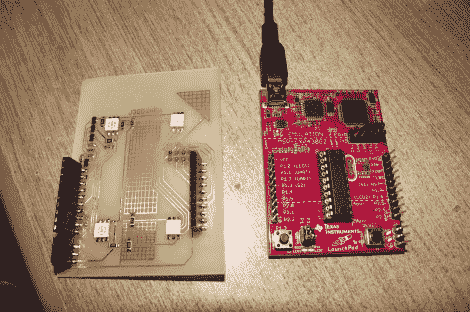

# 基于触摸的无线 RGB 灯控制

> 原文：<https://hackaday.com/2012/02/24/touch-based-wirless-rgb-lamp-control/>

[亚历克斯]为他的 TI launchpad 建造了一个附加板，让他可以将它用作 RGB 灯的无线控制器。正如您在上面所看到的，该板有一对母引脚接头，便于安装或移除该板。这样你就可以毫不费力地将它用于其他项目。

板子本身没有任何按钮。相反，[Alex]蚀刻了双面 PCB，包括用作电容式触摸传感器的焊盘。在这里，我们只能看到电路板的底面，上面有四个 RGB LED 模块。这些通过显示将要为每种颜色设置的级别来提供反馈。在广告之后的视频中，你会看到触摸传感器。有两个像按钮一样的按钮，滚动每个颜色通道，并通过安装在同一侧的无线模块将更新的值发送到灯。还有四个垫作为滑块。我们没有看到任何代码，但显然[这使用了 TI 的触摸传感器库](http://hackaday.com/2011/04/20/capacitive-touch-sensor-shield-for-the-ti-launchpad/)。

[https://www.youtube.com/embed/uyO9hupfm-g?version=3&rel=1&showsearch=0&showinfo=1&iv_load_policy=1&fs=1&hl=en-US&autohide=2&wmode=transparent](https://www.youtube.com/embed/uyO9hupfm-g?version=3&rel=1&showsearch=0&showinfo=1&iv_load_policy=1&fs=1&hl=en-US&autohide=2&wmode=transparent)